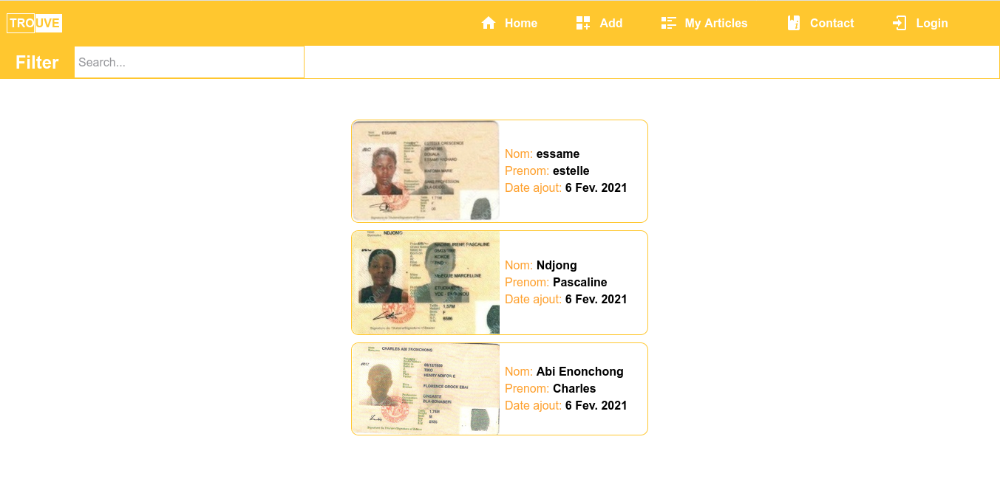
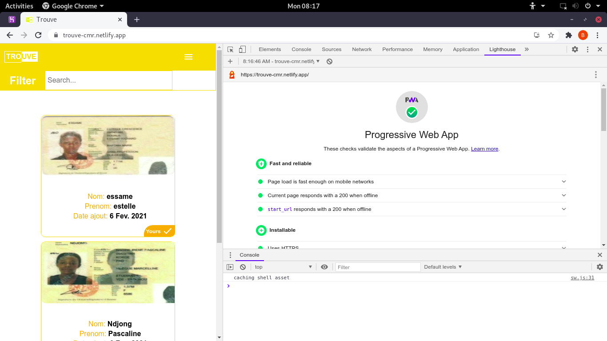

# trouve (Deprecated Mirror)

## About

> Web application implementing a user authentication system that I developed in order to facilitate the search / reporting of lost / found identity documents





## Build Setup

```bash
# install dependencies
$ npm install

# serve with hot reload at localhost:3000
$ npm run dev

# build for production and launch server
$ npm run build
$ npm run start

# generate static project
$ npm run generate
```

For detailed explanation on how things work, check out [Nuxt.js docs](https://nuxtjs.org).
